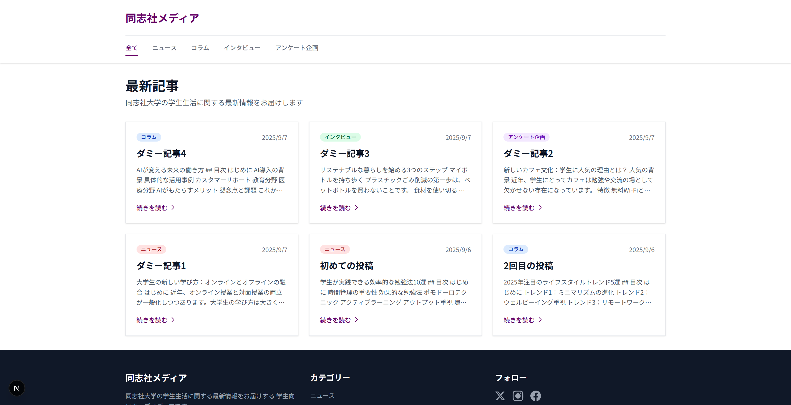
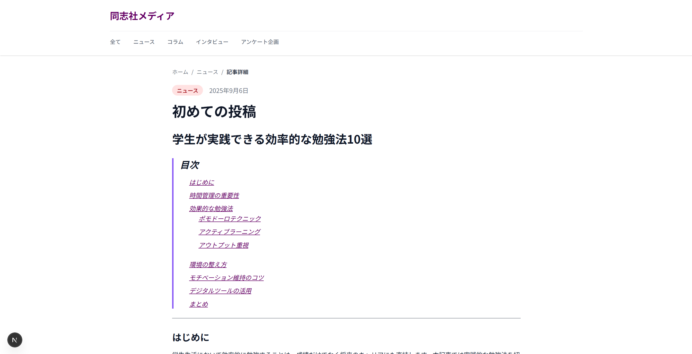
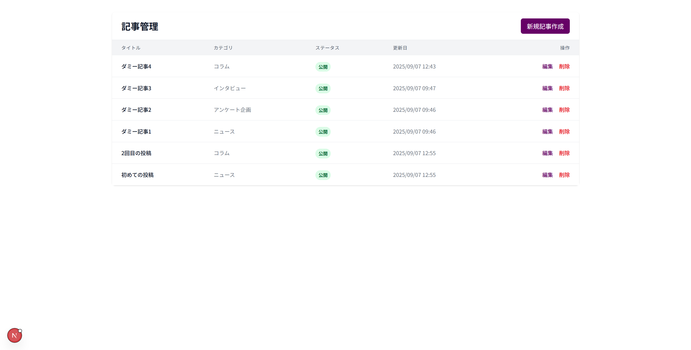
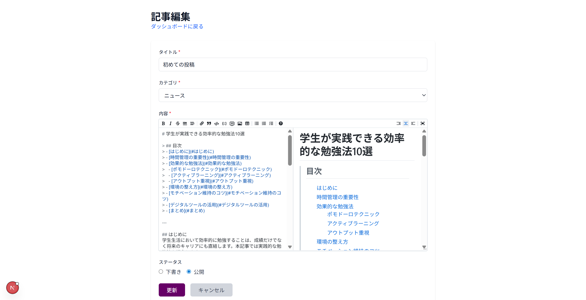

# 同志社メディア (Doshisha Media App)

## 概要

同志社大学の学生およびその関連コミュニティ向けのウェブメディアサイトです。ニュース、コラム、インタビュー、アンケート企画など、学生生活に関する様々な情報を発信します。

### 主な機能

- **記事管理システム**: 管理者による記事の作成・編集・削除
- **Markdownエディタ**: リアルタイムプレビュー機能付き
- **カテゴリ分類**: ニュース、コラム、インタビュー、アンケート企画
- **管理者認証**: NextAuth.jsによる安全な認証システム
- **レスポンシブデザイン**: モバイル・タブレット・デスクトップ対応

## スクリーンショット

### ホームページ


### 記事詳細ページ


### 管理者ダッシュボード


### 記事編集画面


## 技術スタック

| カテゴリ | 技術 |
|---------|------|
| **フレームワーク** | Next.js 15.5.2 (App Router + Turbopack) |
| **言語** | TypeScript 5.0 |
| **スタイリング** | Tailwind CSS 4.0 |
| **データベース** | PostgreSQL (Supabase) |
| **認証** | NextAuth.js 4.24 |
| **Markdownエディタ** | @uiw/react-md-editor 4.0 |
| **Markdown表示** | react-markdown + remark-gfm |
| **デプロイ** | Vercel |

## 必要な環境

- Node.js 18.0以上
- npm または yarn
- Supabaseアカウント
- Git

## セットアップ

### 1. リポジトリのクローン

```bash
git clone https://github.com/mizu20040814/Doshisha-Media-App.git
cd Doshisha-Media-App/doshisha-media-app
```

### 2. 依存関係のインストール

```bash
npm install
```

### 3. 環境変数の設定

`.env.local`ファイルをプロジェクトルートに作成し、以下の環境変数を設定してください：

```env
# Supabase
NEXT_PUBLIC_SUPABASE_URL=your_supabase_url
NEXT_PUBLIC_SUPABASE_ANON_KEY=your_supabase_anon_key

# NextAuth
NEXTAUTH_SECRET=your_random_secret_key
NEXTAUTH_URL=http://localhost:3000

# 管理者認証
ADMIN_USERNAME=admin_username
ADMIN_PASSWORD=admin_password
```

### 4. データベースのセットアップ

Supabaseで以下のテーブルを作成してください：

```sql
CREATE TABLE posts (
  id UUID DEFAULT gen_random_uuid() PRIMARY KEY,
  title VARCHAR(255) NOT NULL,
  content TEXT NOT NULL,
  category VARCHAR(50) NOT NULL,
  status VARCHAR(20) DEFAULT 'draft',
  published_at TIMESTAMP,
  created_at TIMESTAMP DEFAULT CURRENT_TIMESTAMP,
  updated_at TIMESTAMP DEFAULT CURRENT_TIMESTAMP,
  author_id UUID
);
```

## 開発

### 開発サーバーの起動

```bash
npm run dev
```

開発サーバーは http://localhost:3000 で起動します。

### その他のコマンド

```bash
# 本番用ビルド
npm run build

# 本番サーバーの起動
npm run start

# Lintチェック
npm run lint

# TypeScriptの型チェック
npm run type-check
```

## プロジェクト構成

```
doshisha-media-app/
├── app/                    # Next.js App Router
│   ├── admin/             # 管理者ページ
│   │   ├── login/        # ログインページ
│   │   ├── posts/        # 記事管理
│   │   └── page.tsx      # ダッシュボード
│   ├── api/               # APIルート
│   │   ├── auth/         # 認証API
│   │   ├── posts/        # 記事CRUD API
│   │   └── public-posts/ # 公開記事API
│   ├── category/          # カテゴリ別ページ
│   ├── posts/             # 記事詳細ページ
│   └── page.tsx           # ホームページ
├── components/            # Reactコンポーネント
│   ├── Header.tsx        # ヘッダー
│   ├── Footer.tsx        # フッター
│   ├── PostCard.tsx      # 記事カード
│   └── RelatedPosts.tsx  # 関連記事
├── lib/                   # ユーティリティ
│   ├── supabase.ts       # Supabaseクライアント
│   └── utils.ts          # 共通関数
├── types/                 # TypeScript型定義
└── middleware.ts          # 認証ミドルウェア
```

## カテゴリシステム

| カテゴリ | 日本語名 | カラーテーマ |
|---------|---------|-------------|
| news | ニュース | 赤 |
| column | コラム | 青 |
| interview | インタビュー | 緑 |
| survey | アンケート企画 | 紫 |

## 管理者機能

### アクセス方法

1. `/admin/login` にアクセス
2. 環境変数で設定した管理者情報でログイン
3. ダッシュボードから記事の管理が可能

### 利用可能な機能

- 記事の作成（Markdownエディタ使用）
- 記事の編集・削除
- 下書き/公開ステータスの切り替え
- リアルタイムプレビュー

## デプロイ

### Vercelへのデプロイ

1. Vercelアカウントを作成
2. GitHubリポジトリと連携
3. 環境変数を設定
4. デプロイ実行

### 本番環境での注意事項

- **RLS (Row Level Security)** を必ず有効化してください
- **NEXTAUTH_SECRET** は強力なランダム文字列を使用してください
- **ADMIN_PASSWORD** は定期的に変更してください

## 今後の開発予定

- [ ] 画像アップロード機能
- [ ] 記事検索機能
- [ ] ページネーション
- [ ] コメント機能
- [ ] いいね機能
- [ ] SNSシェア機能
- [ ] アンケート機能の実装
- [ ] 記事のタグ機能
- [ ] 管理者の複数アカウント対応

## コントリビューション

バグ報告や機能提案は、GitHubのIssuesからお願いします。プルリクエストも歓迎です！

### 開発フロー

1. Issueを作成または既存のIssueを選択
2. featureブランチを作成 (`git checkout -b feature/amazing-feature`)
3. 変更をコミット (`git commit -m 'Add amazing feature'`)
4. ブランチにプッシュ (`git push origin feature/amazing-feature`)
5. プルリクエストを作成

## ライセンス

このプロジェクトはMITライセンスの下で公開されています。

## お問い合わせ

プロジェクトに関する質問や提案がございましたら、以下までご連絡ください：

- GitHub Issues: [https://github.com/mizu20040814/Doshisha-Media-App/issues](https://github.com/mizu20040814/Doshisha-Media-App/issues)

---

Made for Doshisha University Students